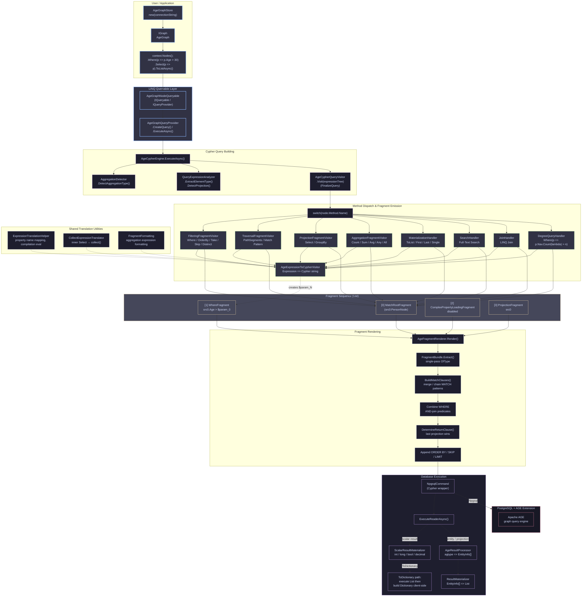

# Apache AGE Provider Architecture

> **Provider:** Cvoya.Graph.Model.Age  
> **Graph Database:** Apache AGE (PostgreSQL extension)  
> **Namespace:** Cvoya.Graph.Model.Age  
> **Abstraction Layer:** GraphModel .NET (graphmodel-dotnet)

---

## Table of Contents

1. [Architectural Overview](#1-architectural-overview)
2. [Layer-by-Layer Walkthrough](#2-layer-by-layer-walkthrough)
3. [LINQ-to-Cypher Translation Pipeline](#3-linq-to-cypher-translation-pipeline)
4. [The Fragment-Based Query Building Pattern](#4-the-fragment-based-query-building-pattern)
5. [Why This Architecture Is Good](#5-why-this-architecture-is-good)
6. [Coding Best Practices](#6-coding-best-practices)
7. [What To Avoid / Pitfalls](#7-what-to-avoid--pitfalls)
8. [What Needs Improvement / Known Limitations](#8-what-needs-improvement--known-limitations)
9. [Testing Strategy](#9-testing-strategy)

---

## 1. Architectural Overview

The AGE provider is a **LINQ IQueryable provider** that translates .NET expression trees into Apache AGE Cypher queries, executes them against a PostgreSQL database, and materializes the results back into .NET objects.



### Key Design Principle: Functional Composition over Inheritance

Instead of one monolithic visitor class that overrides every Visit* method (the classic ExpressionVisitor pattern), the AGE provider uses **delegation to specialized handler classes**. The main visitor acts as a router -- it recognizes LINQ methods and dispatches to the appropriate modular handler.

### Package Architecture

The query translation infrastructure spans three assemblies:

| Assembly | Role |
|---|---|
| **Graph.Model** | Core library: fundamental graph types (IGraph, INode, IRelationship, IGraphPathSegment), type system, serialization contracts, schema attributes |
| **Graph.Model.Cypher** | Shared Cypher abstractions: QueryFragment base, AliasManager, ICypherQueryScope, generic fragments (WhereFragment, ProjectionFragment, OrderFragment, SkipFragment, LimitFragment, DistinctFragment, ReverseOrderFragment, AggregationFragment, GroupByFragment, CollectFragment); Builder interfaces as dormant abstraction layer |
| **Graph.Model.Age** | AGE provider: AgeQueryFragment base, AGE-specific fragments (MatchRootFragment, MatchSegmentFragment, OptionalMatchFragment, ComplexPropertyLoadingFragment), visitors, renderer, execution engine |

---

## 2. Layer-by-Layer Walkthrough

### 2.1 LINQ Queryable Layer

**Files:** AgeGraphQueryableBase.cs, AgeGraphNodeQueryable.cs, AgeGraphRelationshipQueryable.cs, AgeGraphQueryable.cs, AgeGraphQueryProvider.cs

The queryable types capture the expression tree from LINQ method calls. AgeGraphQueryProvider.CreateQuery<T>() is called at each chain step. The provider distinguishes between node queries (INode) and relationship queries (IRelationship).

### 2.1a AgeGraphStore — Provider Entry Point

**File:** [`src/Graph.Model.Age/Core/AgeGraphStore.cs`](src/Graph.Model.Age/Core/AgeGraphStore.cs:26)

The `AgeGraphStore` is the **public user-facing bootstrap class**. Users create an instance with a connection string to connect to AGE:

```csharp
await using var store = new AgeGraphStore(connectionString);
var graph = store.Graph; // IGraph
```

**Key API:**
| Member | Description |
|--------|-------------|
| `AgeGraphStore(connectionString, graphName?, schemaRegistry?, loggerFactory?)` | Main constructor. Builds NpgsqlDataSource, loads `age` extension, sets `search_path`. |
| `AgeGraphStore(dataSource, graphName, loggerFactory, schemaRegistry?)` | Constructor for advanced usage with pre-configured NpgsqlDataSource. |
| `Graph` (property) | Returns the `IGraph` abstraction (`AgeGraph`). Blocks on async init. |
| `DisposeAsync()` | Cleans up the NpgsqlDataSource. |

`AgeGraphStore` is the only public entry point in the AGE assembly alongside `AggregationKind` (enum).

### 2.2 Cypher Engine (AgeCypherEngine)

**File:** AgeCypherEngine.cs (~295 lines)

Orchestrates the translation lifecycle:
1. Detect aggregation via AggregationDetector.DetectAggregationType()
2. Extract element type and detect projections
3. Build Cypher query: CypherQueryContext + AgeCypherQueryVisitor + FinalizeQuery
4. Execute against PostgreSQL via NpgsqlCommand
5. Materialize results (scalar, entity, or projection path)

Special cases: ToDictionary (client-side construction), Single (LIMIT 2 + client validation)

The detection results are expressed via the [`AggregationKind`](src/Graph.Model.Age/Querying/Cypher/Execution/AggregationKind.cs:21) enum:
- `None`, `Count`, `LongCount`, `Any`, `All`, `Sum`, `Average`, `Min`, `Max`, `First`, `Last`, `Single`, `ToDictionary`

### 2.3 Aggregation Detector (AggregationDetector)

Walks the expression tree from outermost method call inward, matching method names to known operations. Returns tags: Count, Sum, First, Single, ToDictionary, etc.

### 2.4 Cypher Query Context (CypherQueryContext)

Single container threading through translation: Scope (CypherQueryScope), ParameterStore (QueryParameterStore), FragmentSequence (List<QueryFragment>), GetQuery() delegates to AgeFragmentRenderer.

### 2.5 Cypher Query Scope (CypherQueryScope)

Manages alias generation and multi-hop traversal: CurrentAlias, CurrentHop, hopAliases[hopNumber] (SourceAlias, RelationshipAlias, TargetAlias), hopTypes[hopNumber], TraversalDirection, GetNumberedAlias(base).

### 2.6 Query Parameter Store (QueryParameterStore)

Centralized store: Add(value) converts via AgeSerializationBridge, deduplicates identical values, returns $param_N reference. Values are NEVER inlined.

### 2.7 Specialized Expression Handlers

| Handler | Handles |
|---|---|
| StringMethodHandler | Contains, StartsWith, EndsWith, ToUpper, ToLower, Substring, Trim, Replace, Length, indexer |
| MathMethodHandler | Abs, Ceiling, Floor, Round, Pow, Sqrt |
| DateTimeMethodHandler | Now, Today, UtcNow, AddDays, AddMonths, AddYears, Year, Month, Day |
| CollectionExpressionHandler | Contains (collections), Count (collections), IGrouping aggregations |
| ClosureCaptureHandler | Closure-captured Count(lambda) on IEnumerable<IRelationship> |
| MemberExpressionHandler | Property access, IGrouping.Key, IGraphPathSegment members |

### 2.8 Modular Fragment Visitors

Each extends FragmentEmittingVisitorBase with CreateExpressionVisitor(), EmitFragment(), ExtractLambda().

| Visitor | Emits |
|---|---|
| TraversalFragmentVisitor | MatchRootFragment, MatchSegmentFragment |
| FilteringFragmentVisitor | WhereFragment, OrderFragment, LimitFragment, SkipFragment, DistinctFragment |
| ProjectionFragmentVisitor | ProjectionFragment, GroupByFragment, ComplexPropertyLoadingFragment |
| AggregationFragmentVisitor | AggregationFragment |
| DegreeQueryHandler | WithFragment + WhereFragment + MatchSegmentFragment (degree queries) |
| NestedCollectHandler | CollectFragment (group.Select(...).ToList() patterns) |

### 2.9 Fragment Renderer (AgeFragmentRenderer)

Renders FragmentSequence to Cypher using FragmentBundle: Build MATCH clauses (merge/chain), OPTIONAL MATCH, WHERE (AND-join), RETURN (last wins), ORDER BY / SKIP / LIMIT.

### 2.10 Fragment Sequence Insights (FragmentSequenceInsights)

Inspects fragment list without rendering. Uses for-loops (not LINQ) to minimize allocations.

### 2.10a Fragment Formatting and Translation Helpers

| Class | File | Role |
|---|---|---|
| [`FragmentFormatting`](src/Graph.Model.Age/Querying/Cypher/Visitors/Core/FragmentFormatting.cs:10) | `internal static class` | `BuildAggregationExpression()` — formats AggregationFragment to Cypher |
| [`ExpressionTranslationHelper`](src/Graph.Model.Age/Querying/Cypher/Visitors/Core/ExpressionTranslationHelper.cs:25) | `internal static class` | `QuotePropertyName()`, `MapPropertyName()`, `TryCompileEval()`, `IsPathSegmentType()` — shared helpers for expression translation |
| [`CollectExpressionTranslator`](src/Graph.Model.Age/Querying/Cypher/Visitors/Core/CollectExpressionTranslator.cs:26) | `internal static class` | `TranslateInnerSelectBody()`, `TranslateInnerExpression()` — translates inner Select lambdas to `collect()` expressions |

### 2.11 Result Processing

AgeResultProcessor reads agtype from NpgsqlDataReader, creates EntityInfo[]. ResultMaterializer converts EntityInfo[] to .NET objects. ScalarResultMaterializer handles raw scalars (int, long, bool, decimal).

### 2.12 Entity CRUD Layer

The entity CRUD layer handles node and relationship persistence (CREATE, UPDATE, DELETE, GET operations), separate from the LINQ query pipeline.

| Class | File | Role |
|---|---|---|
| [`AgeNodeManager`](src/Graph.Model.Age/Core/Entities/AgeNodeManager.cs:28) | `internal sealed class` | `CreateNodeAsync`, `UpdateNodeAsync`, `DeleteNodeAsync`, `GetNodeAsync` |
| [`AgeRelationshipManager`](src/Graph.Model.Age/Core/Entities/AgeRelationshipManager.cs:27) | `internal sealed class` | `CreateRelationshipAsync`, `UpdateRelationshipAsync`, `DeleteRelationshipAsync`, `GetRelationshipAsync` |
| [`AgeEntityMapper`](src/Graph.Model.Age/Core/Entities/AgeEntityMapper.cs:28) | `internal sealed class` | `MapVertex()`/`MapEdge()` → `EntityInfo`. Converts AGE Vertex/Edge to EntityInfo. |
| [`EntityResultReader`](src/Graph.Model.Age/Core/Entities/EntityResultReader.cs:27) | `internal sealed class` | `ReadMultiColumnRowAsync` — reads multi-column rows for projections, path segments, complex properties |
| [`EntityInfoBuilder`](src/Graph.Model.Age/Core/Entities/EntityInfoBuilder.cs:24) | `internal static class` | Builds EntityInfo from dictionaries, JSON, collections |
| [`EntityTypeResolver`](src/Graph.Model.Age/Core/Entities/EntityTypeResolver.cs:25) | `internal static class` | Resolves most-derived .NET type from AGE labels for class hierarchies |
| [`LabelsExtractor`](src/Graph.Model.Age/Core/Entities/LabelsExtractor.cs:27) | `internal static class` | Extracts labels from vertices/edges, handling `inheritance_labels` |
| [`CypherQueryHelper`](src/Graph.Model.Age/Core/Entities/CypherQueryHelper.cs:24) | `internal static class` | Helper methods for building Cypher in entity validation |

### 2.13 Schema Validation and Serialization

| Class | File | Role |
|---|---|---|
| [`AgeEntityAttributeValidator`](src/Graph.Model.Age/Core/Entities/AgeEntityAttributeValidator.cs:27) | `internal static class` | Validates property rules + unique constraints before persist |
| [`PropertyRuleValidator`](src/Graph.Model.Age/Core/Entities/PropertyRuleValidator.cs:24) | `internal static class` | Validates property-level rules |
| [`UniqueConstraintValidator`](src/Graph.Model.Age/Core/Entities/UniqueConstraintValidator.cs:25) | `internal static class` | Validates unique constraints (composite keys and individual unique properties) |
| [`ConflictLogger`](src/Graph.Model.Age/Core/Entities/ConflictLogger.cs:27) | `internal static class` | Logs conflict details when unique constraint validation fails |
| [`AgeSerializationBridge`](src/Graph.Model.Age/Core/Entities/AgeSerializationBridge.cs:24) | `internal static class` | Converts between GraphModel values and AGE representations (`SerializeSimpleProperties`, `ToAgeValue`, `FromAgeValue`) |
| [`AgeValueConverter`](src/Graph.Model.Age/Core/Entities/AgeValueConverter.cs:22) | `AgeValueConverter : IValueConverter` | IValueConverter implementation for AGE |
| [`AgeValueConverters`](src/Graph.Model.Age/Core/Entities/AgeValueConverters.cs:27) | `internal static class` | Static helpers for Agtype → CLR conversion |

### 2.14 Internal Infrastructure

| Class | File | Role |
|---|---|---|
| [`GraphOperationHelper`](src/Graph.Model.Age/Core/Internal/GraphOperationHelper.cs:25) | `internal static class` | Try-catch boilerplate reducer for AgeGraph methods |
| [`TransactionHelpers`](src/Graph.Model.Age/Core/Internal/TransactionHelpers.cs:20) | `internal static class` | Auto-create/auto-commit/rollback transaction management |
| [`ColumnDefinitionBuilder`](src/Graph.Model.Age/Querying/Cypher/Execution/ColumnDefinitionBuilder.cs:30) | `internal static class` | Builds SQL column definitions and Cypher commands for AGE projection queries |
| [`CollectionHelper`](src/Graph.Model.Age/Querying/Cypher/Execution/CollectionHelper.cs:10) | `internal static class` | Converts lists of scalar results to expected return type |
| [`GraphPathSegment`](src/Graph.Model.Age/Querying/Cypher/Execution/GraphPathSegment.cs:27) | `internal sealed record` | Concrete path segment record for materialization (duplicate at `Linq/GraphPathSegment.cs:17`) |

---

## 3. LINQ-to-Cypher Translation Pipeline

This is the heart of the provider. Here is the step-by-step translation of a concrete example:

### Example: Find friends-of-friends of Alice

```
await context.Nodes<Person>()
    .Where(p => p.FirstName == "Alice")
    .PathSegments<Person, Knows, Person>()
    .Select(ps => ps.EndNode)
    .PathSegments<Person, Knows, Person>()
    .Select(ps => new {
        FriendName = ps.EndNode.FirstName,
        MutualFriend = ps.StartNode.FirstName
    })
    .ToListAsync();
```

#### Step 1: context.Nodes<Person>()
VisitConstant -> _queryInitHandler.SetupInitialMatch(typeof(Person))
Generates alias src0. Emits MatchRootFragment.

#### Step 2: .Where(p => p.FirstName == "Alice")
Routes to _filteringVisitor.HandleWhere(): Visit source, extract lambda, VisitAndReturnCypher resolves src0.FirstName = $param_0. Emits WhereFragment.

#### Step 3: .PathSegments<Person, Knows, Person>() (first, hop 0)
Routes to TraversalFragmentVisitor: NOT chained, generates src0/r0/tgt0, stores hop 0 aliases, builds (src0:PersonNode)-[r0:KnowsRelationship]->(tgt0:PersonNode). Emits MatchRootFragment. Advances hop to 1.

#### Step 4: .Select(ps => ps.EndNode)
Emits ComplexPropertyLoadingFragment(false). Resolves ps.EndNode -> tgt0 (hop 0 target). Updates CurrentAlias to tgt0. Emits ProjectionFragment.

#### Step 5: .PathSegments (chained, hop 1)
Detects chained mode. Source = tgt0, rel = r1, target = tgt1. Builds -[r1:KnowsRelationship]->(tgt1:PersonNode). Emits MatchSegmentFragment.

#### Step 6: .Select(ps => new { FriendName, MutualFriend })
Anonymous type -> NewExpression. ps.EndNode.FirstName -> tgt1.FirstName AS c_FriendName. ps.StartNode.FirstName -> tgt0.FirstName AS c_MutualFriend.

#### Step 7-9: ToListAsync, FinalizeQuery, Rendering

Generated Cypher:

```
MATCH (src0:PersonNode)-[r0:KnowsRelationship]->(tgt0:PersonNode)
      -[r1:KnowsRelationship]->(tgt1:PersonNode)
WHERE src0.FirstName = $param_0
RETURN tgt1.FirstName AS c_FriendName, tgt0.FirstName AS c_MutualFriend
```

### LINQ to Cypher Translation Reference

| LINQ | Cypher | Notes |
|---|---|---|
| .Where(p => p.Age == 42) | WHERE src0.Age = $param_0 | All constants parameterized |
| .Where(p => p.Name == null) | WHERE src0.Name IS NULL | Null-safe, not = NULL |
| .Where(p => p.Name != null) | WHERE src0.Name IS NOT NULL | |
| .Where(p => p.Name.Contains("ohn")) | WHERE src0.Name CONTAINS $param_0 | Uses native Cypher `CONTAINS` operator. Parameterized value. |
| .Select(p => new { N = p.Name }) | RETURN src0.Name AS c_N | c_ prefix avoids conflicts |
| .OrderBy(p => p.Age) | ORDER BY src0.Age ASC | |
| .Take(10) | LIMIT 10 | |
| .Skip(5) | SKIP 5 | |
| .Distinct() | RETURN DISTINCT ... | |
| .Count() | RETURN count(*) | |
| .Any() | RETURN count(*) -> client > 0 | ScalarResultMaterializer converts to bool |
| .All(p => p.Age > 18) | WHERE NOT(cond) RETURN count(*) | Negated condition |
| .Sum(p => p.Age) | RETURN sum(src0.Age) | |
| .First() | ... LIMIT 1 | |
| .Last() | ORDER BY ... DESC ... LIMIT 1 | Uses ReverseOrderFragment |
| .Single() | ... LIMIT 2 + client validation | Client checks >1 elements |
| p.Age >= 30 ? "A" : "B" | CASE WHEN ... THEN ... ELSE ... END | Ternary to CASE |
| .Join(...) | Multiple MATCH clauses | |
| .Search("query") | WHERE prop =~ '(?i)\mquery\M' | Per-property POSIX regex with word-boundary anchors |
| .GroupBy(p => p.Name).Select(...) | RETURN ... GROUP BY ... | |
| .PathSegments<A,R,B>() | MATCH ...-[R]->... | First segment |

---

## 4. The Fragment-Based Query Building Pattern

The critical architectural innovation is the **Fragment-Based Query Building** pattern, replacing the traditional string-builder approach.

### Fragment Hierarchy

```
QueryFragment (abstract, in Graph.Model.Cypher)     [Shared: WHERE, ORDER BY, etc.]
+-- WhereFragment          WHERE predicate
+-- ProjectionFragment     RETURN expressions
+-- OrderFragment          ORDER BY
+-- SkipFragment           SKIP
+-- LimitFragment          LIMIT
+-- DistinctFragment       DISTINCT
+-- ReverseOrderFragment   Reverse ORDER BY (Last())
+-- AggregationFragment    count, sum, avg, min, max
+-- GroupByFragment        GROUP BY
+-- CollectFragment        collect({...})
+-- WithFragment           WITH clause (degree queries, intermediate projections)
|
+-- AgeQueryFragment (abstract, in Graph.Model.Age) [AGE-specific: MATCH]
    +-- MatchRootFragment           Root MATCH (full pattern)
    +-- MatchSegmentFragment        Chained traversal segment
    +-- OptionalMatchFragment       OPTIONAL MATCH (complex props)
    +-- ComplexPropertyLoadingFragment  Toggle complex property mode
```

The AGE-specific fragments (`MatchRootFragment`, `MatchSegmentFragment`, `OptionalMatchFragment`, `ComplexPropertyLoadingFragment`) are defined in [`AgeQueryFragments.cs`](src/Graph.Model.Age/Querying/Cypher/Visitors/Core/AgeQueryFragments.cs).

### Why Fragments Instead of String Building?

| Aspect | Fragment Approach | String Building |
|---|---|---|
| Debugging | Inspect fragment list | Must parse generated string |
| Testing | Assert on fragment types | Assert on string contains |
| Reordering | Renderer reorders easily | Harder to restructure |
| Extensions | Add new fragment type | Fragile string manipulation |
| Composability | Fragments carry metadata | Information lost |

---

## 5. Why This Architecture Is Good

### 5.1 Separation of Concerns

Each concern has its own class: AgeCypherQueryVisitor (routing), FilteringFragmentVisitor (WHERE/ORDER), TraversalFragmentVisitor (MATCH), ProjectionFragmentVisitor (SELECT), AgeExpressionToCypherVisitor (expr->string), AgeFragmentRenderer (sequence->string).

### 5.2 Testability Without a Database

FragmentRendererTests can test the full pipeline without PostgreSQL using TestGraphQueryProvider + TestGraphNodeQueryable. 80%+ of query bugs caught in pure unit tests.

### 5.3 Fragment Declarative Semantics

Immutable C# records give transparency, replayability, and composability.

### 5.4 Modular Handler Pattern

Low coupling, single responsibility, easy extension. Add a new LINQ method by adding one case and one handler.

### 5.5 Multi-Hop Traversal with Alias Tracking

CypherQueryScope tracks aliases across chained hops: StoreHopAliases, GetHopAliases, AdvanceHop.

### 5.6 Context-Free Expression Translation

AgeExpressionToCypherVisitor translates expressions to Cypher strings without side effects on the fragment sequence.

### 5.7 Shared Fragment Infrastructure

Generic fragments in Graph.Model.Cypher enable potential reuse by Neo4j or future providers.

---

## 6. Coding Best Practices

### 6.1 Adding a New LINQ Method

1. Add method name to switch in AgeCypherQueryVisitor.VisitMethodCall
2. Use VisitThen(node, handler) to visit source first
3. Create or extend a fragment visitor with Handle* method
4. Add fragment type if needed
5. Update AgeFragmentRenderer
6. Update FragmentSequenceInsights if needed
7. Write FragmentRendererTests test
8. Write integration test

### 6.2 Key Conventions

- Visit source (args[0]) FIRST
- Use VisitAndReturnCypher(), not Visit() directly
- Return Expression.Constant(cypherString) from overrides
- Use switch expressions, not if/else chains
- Add fragments via Context.AddFragment() only
- Use immutable records for fragments
- Never inline values in Cypher strings

### 6.3 Projection Handling

- Anonymous types detected via NewExpression with CompilerGeneratedAttribute
- Member names from newExpr.Members[i].Name or constructor params for records
- Use c_ prefix for column aliases to avoid keyword conflicts
- Disable complex property loading with ComplexPropertyLoadingFragment(false)
- Last projection wins
- Expand IGraphPathSegment params to all 3 components

### 6.4 Testing

- Pure unit tests: TestGraphQueryProvider + TestGraphNodeQueryable
- Assert on fragments for intermediate state
- Assert on Cypher strings for final output
- Use RendererMatchesBuilder* pattern
- Log generated Cypher with Console.WriteLine()
- Test both ToListAsync and await foreach paths

---

## 7. What To Avoid / Pitfalls

### 7.1 Architecture Pitfalls

| Pitfall | Alternative |
|---|---|
| Modifying FragmentSequence directly | Use Context.AddFragment() |
| String building in handlers | Emit declarative fragment objects |
| Rendering in the visitor | Leave to AgeFragmentRenderer |
| Mutable fragment types | Use C# records |
| Hardcoded alias names | Derive from CypherQueryScope |
| Visiting source AFTER handler | Use VisitThen to visit source first |

### 7.2 AGE-Specific Pitfalls

| Pitfall | Effect | Mitigation |
|---|---|---|
| size() with pattern | AGE syntax error at : | Use subqueries or client-side counting |
| CALL { } subqueries | Not supported in AGE | Avoid nested GroupBy |
| Multi-label `:A\|B` | Syntax error | Use separate `MATCH` with `OR` |
| toString(vertex) | Unsupported argument agtype | Use per-property strings |
| Label-less MATCH | Picks up ALL vertices | Add inheritance_labels filter |

### 7.3 Never Do

- Never inline values in Cypher strings
- Never mutate a fragment after adding it
- Never create a new CypherQueryContext mid-translation
- Never skip FinalizeQuery
- Never assume a single MATCH clause

---

## 8. What Needs Improvement / Known Limitations

This section is split into two categories:
1. **AGE Platform Limitations** — constraints inherited from the Apache AGE extension itself
2. **Provider Limitations** — gaps in our LINK-to-Cypher translation that could be improved

### 8.1 AGE Platform Limitations (Inherited)

These limitations come from Apache AGE itself. The provider translates LINQ correctly, but the underlying AGE Cypher dialect does not support these features. They affect all AGE users, not just this provider.

| Feature | Problem | Example | Workaround / Mitigation |
|---|---|---|---|
| **`size()` with pattern expressions** | Pattern expressions containing `:` inside `size()` cause a syntax error in AGE | `size((src0)-[:REL]->())` is invalid | Compute counts via a separate MATCH + `count(*)`, or client-side after materialization. See [ClosureCaptureHandler](Querying/Cypher/Visitors/ClosureCaptureHandler.cs) for partial support. |
| **`CALL { }` subqueries** | AGE does not support subqueries with `CALL { }` | Cannot write nested subqueries for advanced grouping | Avoid nested `GroupBy`/`collect()` patterns that would require subqueries. Split into multiple queries and combine client-side. |
| **Multi-label patterns (`:A\|B`)** | AGE does not support the label disjunction operator (`\|`) in MATCH patterns. In standard Neo4j Cypher, `MATCH (n:Person\|Movie)` matches nodes with **either** `Person` **or** `Movie` label. AGE's openCypher dialect has no grammar rule for `\|` in label expressions — the parser handles only single labels per entity in MATCH patterns. Attempting `MATCH (n:A\|B)` produces an AGE parser error. | `MATCH (n:A\|B)` causes a syntax error | Use separate `MATCH` clauses combined with `UNION` (disjoint result sets) or filter with `WHERE n:A OR n:B` (single result set). The GraphModel provider never generates `:A\|B` — it uses separate MATCH patterns or WHERE disjunction. |
| **`toString(vertex)` / `toString(edge)`** | `toString()` does not accept vertex or edge types — only scalar agtype values | `toString(src0)` throws "unsupported argument agtype" | Use per-property string conversions instead |
| **Native full-text search (FTS)** | AGE has no `tsvector`/`tsquery` support for graph properties | No server-side index for searching across string properties | Current provider uses per-property `=~` regex, which is functional but slower. See [Full-Text Search Limitations](age-fulltext-search-limitations.md) for details. |
| **`ORDER BY` on vertices/edges** | You cannot sort results by a node or edge variable directly | `ORDER BY n` is invalid — must use a property | Always order by a property: `ORDER BY n.property` |
| **`RETURN *` with specific column ordering** | `RETURN *` returns all bound variables but the column order is unpredictable | Cannot guarantee column order for materialization | Each column is explicitly listed in the RETURN clause |

### 8.2 Provider Limitations (LINQ-to-Cypher Translation Gaps)

These are features where the **provider itself** could be improved — the LINQ query is valid, the target Cypher concept exists in AGE, but the translation pipeline does not yet support it.

For each limitation we show:
- The **LINQ query** the user would like to write
- The **target AGE Cypher** it should produce
- Why the current provider cannot translate it

---


#### 8.2.1 Nested GroupBy / Pattern Comprehension

**LINQ query (limited support):**

```csharp
await context.Nodes<Person>()
    .GroupBy(p => p.Name)
    .Select(g => new
    {
        Name = g.Key,
        Friends = g.Select(p => p.FirstName).ToList()  // nested collection projection
    })
    .ToListAsync();
```

**Target AGE Cypher (not supported by AGE):**

```cypher
MATCH (src0:PersonNode)
WITH src0.Name AS c_Name, collect(src0.FirstName) AS c_Friends
```

**Current limitation:** The simple case (collect a single property per group) works because it uses Cypher's auto-group-by. However, more complex nested projections (multi-property collect objects, chained GroupBy + Select + ToList) require `CALL { }` subqueries **which AGE does not support**. The `NestedCollectHandler` provides partial support for some patterns. See [Pattern Comprehension Limitations](pattern-comprehension-limitations.md) for details.

---

#### 8.2.2 Closure-Captured Count(lambda) for Degree Queries

**LINQ query (partially supported):**

```csharp
await context.Nodes<Person>()
    .Where(p => p.Friends.Count(friend => friend.Age > 30) > 5)
    .ToListAsync();
```

**Target AGE Cypher:**

```cypher
MATCH (src0:PersonNode)-[r0:KnowsRelationship]->(tgt0:PersonNode)
WITH src0, count(r0) AS degree
WHERE degree > 5
RETURN src0
```

**Current status:** The [`DegreeQueryHandler`](src/Graph.Model.Age/Querying/Cypher/Visitors/Core/Modular/DegreeQueryHandler.cs:26) provides **complete support** for the Where-predicate case (`Where(p => p.Nav.Count(lambda) > n)`). It emits the full fragment sequence: `MatchSegmentFragment` → [`WithFragment`](src/Graph.Model.Cypher/Querying/Cypher/Visitors/Core/QueryFragments.cs:145) (with degree computation) → `WhereFragment` (with threshold comparison) → `ProjectionFragment`. The [`ClosureCaptureHandler`](src/Graph.Model.Age/Querying/Cypher/Visitors/ClosureCaptureHandler.cs:31) detects the closure-captured `Count(lambda)` pattern and delegates to `DegreeQueryHandler`. However, support for `Count(lambda)` in `Select` projections or deeply nested expressions is not yet implemented.

---


#### 8.2.3 Path Segment Whole-Object Projection

**LINQ query:**

```csharp
await context.Nodes<Person>()
    .PathSegments<Person, Knows, Person>()
    .Select(ps => new { Path = ps })   // project the whole IGraphPathSegment
    .ToListAsync();
```

**Currently produces:** (three separate Cypher columns, each wrapped in a full AGE query)

```cypher
MATCH (src0:PersonNode)-[r0:KnowsRelationship]->(tgt0:PersonNode)
RETURN src0 AS c_Path_src0, r0 AS c_Path_r0, tgt0 AS c_Path_tgt0
```

**What the user wants:** A single query that returns the entire `IGraphPathSegment` as a cohesive result, so the provider can reconstruct the three components back into a single `IGraphPathSegment<PersonNode, KnowsRelationship, PersonNode>` object.

**Current limitation:** The Cypher generation emits the correct three RETURN columns with `c_Path_*` aliasing. However, the `ColumnDefinitionBuilder` layer (which maps Cypher output columns to .NET constructor parameters) needs updating to recognize that three columns with the pattern `c_Path_src0`, `c_Path_r0`, `c_Path_tgt0` should be reassembled into a single `IGraphPathSegment<,,>` instance instead of being treated as three separate scalar values.

---

#### 8.2.4 Coalesce/Lazy Load for Complex Properties

**LINQ query (partially optimized):**

```csharp
await context.Nodes<PersonWithAddress>()
    .Select(p => new {
        p.Name,
        Street = p.HomeAddress != null ? p.HomeAddress.Street : null
    })
    .ToListAsync();
```

**Currently produces (projection mode):** (targeted OPTIONAL MATCH for referenced properties)

```cypher
MATCH (src0:PersonNode)
OPTIONAL MATCH (src0)-[r_HomeAddress:_graphmodel_prop_HomeAddress]->(cp_HomeAddress)
RETURN src0.Name AS c_Name, cp_HomeAddress.Street AS c_Street
```

**Full hydration mode** (when no projection is present, e.g. materializing whole nodes) still uses the heavier OPTIONAL MATCH + collect() block:

```cypher
MATCH (src0:PersonNode)
OPTIONAL MATCH (src0)-[prop_rel]->(prop_node)
WHERE type(prop_rel) STARTS WITH '_graphmodel_prop_'
WITH src0,
     collect({
         ParentNode: src0,
         Relationship: prop_rel,
         SequenceNumber: coalesce(prop_rel.SequenceNumber, 0),
         Property: prop_node
     }) AS complex_properties
RETURN {
    Node: src0,
    ComplexProperties: complex_properties
}
```

**Resolution (partial):** The [`FilterReferencedComplexPropertyMatches`](src/Graph.Model.Age/Querying/Cypher/Visitors/Core/AgeFragmentRenderer.cs:759) method in `AgeFragmentRenderer.cs` implements **targeted complex property loading** for projection queries. When `ProjectionFragment`s are present and complex property loading is disabled (projection mode), it:

1. Scans projection RETURN expressions for patterns matching `cp_{PropertyName}` references
2. Filters `OptionalMatchFragment`s to only include those whose `cp_` alias matches a referenced property
3. If no complex properties are referenced in the projection, all OPTIONAL MATCH clauses for complex properties are suppressed entirely

**Remaining work:** The targeted loading only works in projection mode (when `ComplexPropertyLoadingFragment(false)` has been emitted). Full hydration mode still loads ALL complex properties. A future optimization could extend targeted loading to entity materialization paths by analyzing the CLR type's accessed properties.

---


### 8.3 Architectural Improvements (Medium Priority)

| Improvement | Description |
|---|---|
| **Plugin-based LINQ method registration** | Currently, adding support for a new LINQ method requires modifying the `switch` statement in `AgeCypherQueryVisitor.VisitMethodCall`. This is a barrier for external contributors and tightly couples all method knowledge into one class. Future versions should define an interface (e.g., `ILinqMethodHandler { bool CanHandle(MethodCallExpression); void Handle(MethodCallExpression, CypherQueryContext); }`) that can be registered via DI or a registry pattern. This would allow users to add custom translations without forking the library, and let the core team ship new method support as separate NuGet packages. |
| **Fragment Graph (not just flat sequence)** | `FragmentSequence` is a flat list but queries can have branching structure (JOINs, subqueries). Introduce parent-child fragment relationships. |
| **Lazy Parameter Materialization** | Parameters are eagerly added during visiting. For large `Contains` collections this creates many `$param_N` entries. Defer until the renderer needs them. |
| **Query Plan Caching** | Cache rendered Cypher strings for identical expression trees to avoid repeated visiting. |
| **Batch Execution** | Batch write operations (CREATE, SET, DELETE) into single Cypher queries instead of one-at-a-time. |
| **Provider-Agnostic Visitor Pipeline** | Extract common visitor infrastructure into `Graph.Model.Cypher` for reuse by Neo4j and future providers. |
| **ScalarResultMaterializer for expression projections** | Support direct scalar materialization for projected expressions like `Select(p => p.Age + 10)` without going through the full EntityInfo pipeline. |
| **SQL Injection Vectors in ColumnDefinitionBuilder** | The `ColumnDefinitionBuilder` directly interpolates `graphName` and `columnDefinitions` into the SQL query string without sanitization or parameterization. Although these values originate from internal provider code (not user input), any future code path that accepts external input into these fields would create an SQL injection vulnerability. Documented as security technical debt. |
| **Expression Compilation Without Caching** | Multiple locations compile expression trees at query time without caching: `TryEvaluateStaticMember`, `FallbackEvaluate`, `ClosureCaptureHandler`. Each call compiles and invokes a new lambda, which allocates and avoids the expression compilation cache built into .NET. This is a performance bottleneck for queries that repeatedly trigger these fallback paths. |
| **ConfigureAwait(false) Inconsistency** | Some async execution paths use `ConfigureAwait(false)` while others do not. In library code that can run in both UI and server contexts, `ConfigureAwait(false)` should be consistently applied to avoid potential deadlocks in UI/synchronization-context scenarios. This is a best-practice gap that should be standardized across all `await` calls. |
| **GraphPathSegment Duplication** | There are two identical `GraphPathSegment` records: one in [`Querying/Cypher/Execution/`](src/Graph.Model.Age/Querying/Cypher/Execution/GraphPathSegment.cs) and one in [`Querying/Linq/`](src/Graph.Model.Age/Querying/Linq/GraphPathSegment.cs). One should be removed and all references unified. |

---

### 8.4 What We Do Well (Not Limitations)

For context, here are features that **work correctly** and are NOT limitations:

- **Full LINQ method chain**: Where, Select, OrderBy, ThenBy, Take, Skip, Distinct, Count, LongCount, Sum, Average, Min, Max, Any, All, First, FirstOrDefault, Last, LastOrDefault, Single, SingleOrDefault
- **Multi-hop path traversal**: Chained `.PathSegments()` with correct alias tracking
- **Anonymous type projections**: Multi-column RETURN with correct `c_` aliasing
- **Ternary expressions**: `CASE WHEN ... THEN ... ELSE ... END` translation
- **Null handling**: `IS NULL` / `IS NOT NULL` instead of `= NULL`
- **String methods**: Contains, StartsWith, EndsWith, ToUpper, ToLower, Substring, Trim, Replace
- **Math methods**: Abs, Ceiling, Floor, Round, Pow, Sqrt
- **DateTime methods**: Now, Today, UtcNow, AddDays/AddMonths/AddYears
- **Inheritance filtering**: Correct `inheritance_labels` WHERE clause for derived types
- **Interface relationship queries**: Label-less MATCH for `IRelationship` queries
- **Complex property hydration**: OPTIONAL MATCH + collect() for nodes with sub-node properties
## 9. Testing Strategy

| Level | What | DB? | Location |
|---|---|---|---|
| Pure unit | Fragment rendering, expression translation | No | FragmentRendererTests.cs, SearchHandlerTests.cs |
| Integration | Full pipeline | Yes | GraphModelTests/*.cs |
| Async | Async execution paths | Yes | AsyncExecutionCoverageTests.cs |
| Regression | Known bugs | Yes | AliasGenerationRegressionTests.cs |

### Running Tests

```
# Pure unit tests (no database needed)
dotnet test tests/Graph.Model.Age.Tests --filter "FullyQualifiedName~FragmentRendererTests"

# Search handler unit tests
dotnet test tests/Graph.Model.Age.Tests --filter "FullyQualifiedName~SearchHandlerTests"

# Single integration test
AGE_CONNECTION_STRING="..." dotnet test --filter "CanCreateNodeQuery"

# Full suite
AGE_CONNECTION_STRING="..." dotnet test
```

### Debugging Query Translation

```
var provider = new TestGraphQueryProvider();
var source = new TestGraphNodeQueryable<PersonNode>(provider);
var query = source.Where(p => p.Age > 30).Select(p => new { p.Name });
var context = new CypherQueryContext(typeof(PersonNode));
var visitor = new AgeCypherQueryVisitor(context);
visitor.Visit(query.Expression);
var cypher = context.GetQuery();
Console.WriteLine(cypher);
```

---

## Appendix A: Related Documentation

| Document | Path | Content |
|---|---|---|
| Pattern Comprehension Limitations | docs/age/pattern-comprehension-limitations.md | Known GroupBy + collect() limitations |
| Full-Text Search Limitations | docs/age/age-fulltext-search-limitations.md | =~ regex approach limitations |
